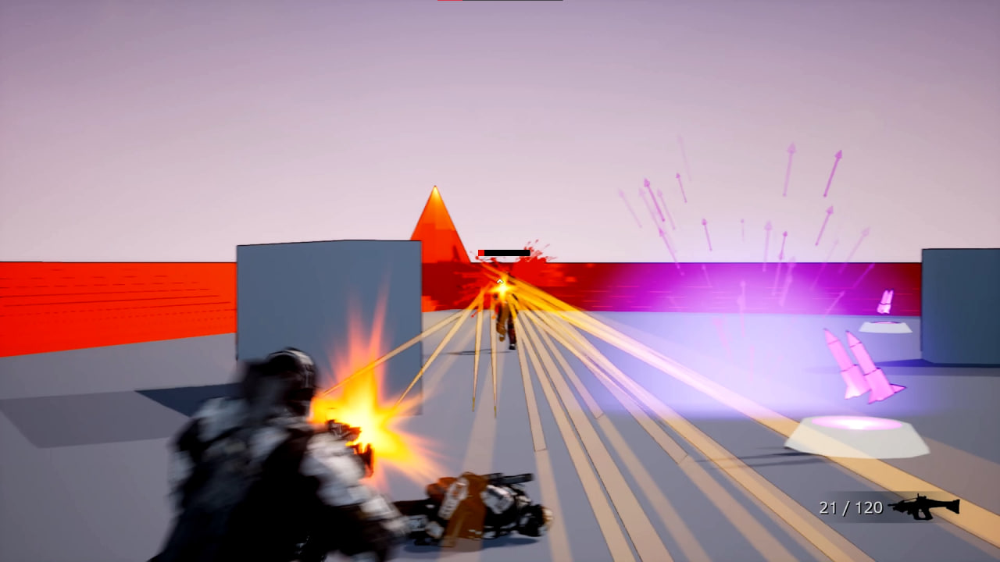

# Shooter Arena

## Summary

Shooter Arena is single-player Quake-like arena game build with Unreal Engine 5.

You can play it here: [Shooter Arena Itch Io](https://seregaengine.itch.io/shooter-arena).

Watch 10 minutes of gameplay: [YouTube Video](https://www.youtube.com/watch?v=8moWYqnqtsU&t=171s).

## Features
- AI behavior using EQS, AI Sense, Behavior Tree
- Player HUD: health, gun, ammo
- Team Deathmatch
- Pickups: health, rifle, rockets
- Outline and cartoon shaders

## Levels

### Open Arena

### 2x2 Arena 

## Screenshots

